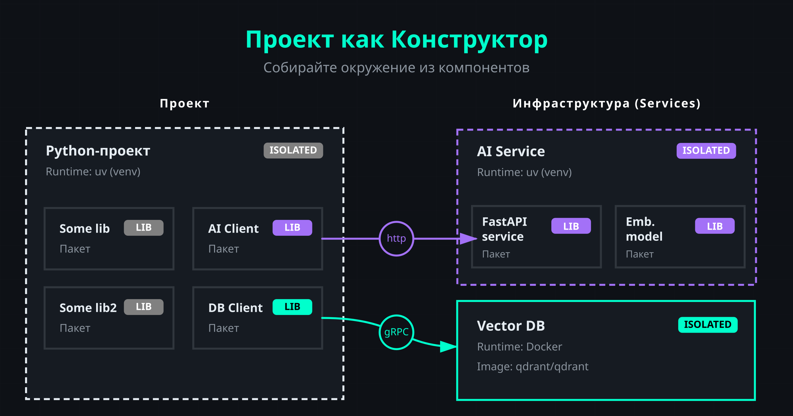
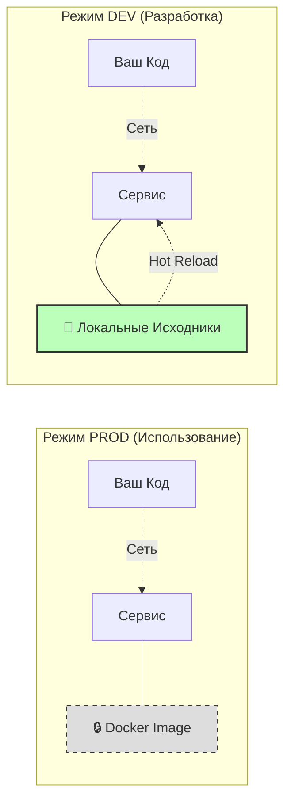
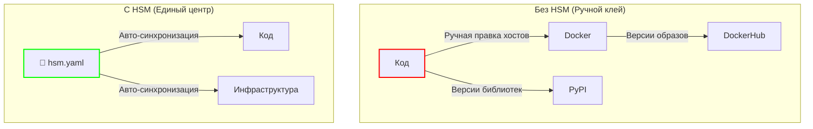
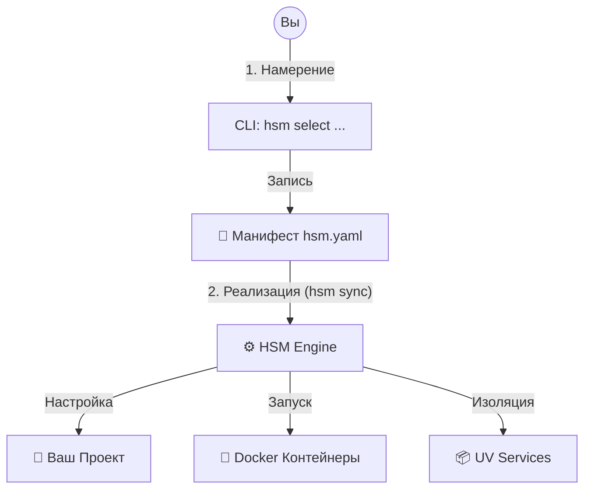
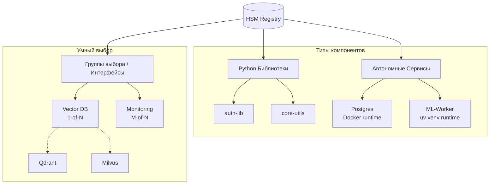

# Финальный черновик главной страницы HSM (Версия 7: Полная переработка)

> [!NOTE] Source: feedback_2026-02-14_06-01-01.md
> **User Insight**: Упростить язык, использовать аналогию с конструктором, четко разделить Намерение (CLI) и Реализацию (Sync). Показать пример с заменой БД. Убрать эмодзи. Добавить описание новой SVG диаграммы.

## О проекте
**HSM (Hyper Stack Manager)** — это инструмент, который превращает ваш проект в конструктор, состоящий из компонентов.

**Проект** — это ваш проект на Python в виртуальном окружении (`venv`) `uv`.

**Компонент** — это:
*   **Библиотека** (Python-пакет).
*   **Сервис** (база данных, брокер очередей, API, ML-модель, развернутая в виде сервиса на инференсе).

Сервис это:
- контейнер (`docker` / `podman`)
- папка с python venv (`uv` / `pixi`)

### Подход проект как Конструктор

Представим проект в виде конструктора из кубиков-компонентов.



**Слева — Проект**:

Проект:
- работает в изолированном окружении `uv (venv)`.
- придерживается модульной архитектуры.
- взаимодействует с инфраструктурой через **абстрактные интерфейсы**.

В данном примере абстракции:
- `vector-db-client` — интерфейс для работы с абстрактной векторной БД.
- `emb-client` — интерфейс для получения эмбеддингов от абстрактного сервиса.

И есть реализации этих интерфейсов для конкретного стека технологий:

- пакет `qdrant-client` — интерфейс для работы с сервисом с векторной БД `qdrant`.
- пакет `milvus-client` — интерфейс для работы с сервисом с векторной БД `milvus`.
- пакет `qwen3-client` — интерфейс для получения эмбеддингов от сервиса с моделью `Qwen3-Embedding-8B`.
- пакет `bge-m3-client` — интерфейс для получения эмбеддингов от сервиса с моделью `BAAI/bge-m3`.

HSM предоставляет механизм групп:
- `1 from N`:
    Из возможного набора можно выбрать только 1 одновременно.

Например:
- группа python-пакеты клиенты для векторных БД [`qdrant-client`, `milvus-client`].
- группа сервисы для векторных БД [`qdrant-service`, `milvus-service`].


- У проекта есть:
1. пакеты (`Some lib`)
2. пакеты, реализующие эти абстрактные интерфейсы (`AI Client`, `DB Client`)
3. пакеты, взаимодействующие с сервисами (в нашем примере, `AI Client`, `DB Client`).


- 

**Справа — Инфраструктура (Services)**:

1. **Vector DB**: 

Это сервис предоставляющий конкретную векторную БД (например, Qdrant). Запущен через `docker`-контейнер.

2. **AI Service**:

HSM так же умеет создавать изолированные виртуальные окружения (`uv`, `pixi`) в папке:
- Это дает возможность запустить сервис `как в контейнере`, только в качестве изоляции будет `venv`.
- Это удобно для быстрой разработки и позовляет разврачиватьсервисы там, где нет возможности использовать контейнеризацию.
- Это окружение в котором hsm тоже может управлять пакетами как и в основном проекте
- Это окружение не является учасником workspace и основной проект не имеет с ним жесткой связи (как в `git sub modules` или `uv workspaces`)

Внутри сервиса AI Service есть пакеты:
- FastAPI service
- Emb-model для работы с конкретной моделью (например, ) для получения эмбеддингов


3.  **Связи (Arrows)**:
    *   HSM — как менеджер стека проекта настроит установку `AI Client` на общение с `AI Service` (по HTTP) и `DB Client` на общение с `Vector DB` (по gRPC).

Вы просто добавляете кубик `AI Client`, а HSM сам понимает: "Ага, ему нужен `AI Service`", скачивает его, запускает в отдельном venv и прописывает порты.

---

## Два состояния кубика

В HSM каждый компонент может находиться в одном из двух режимов. Вы переключаете их на лету:

*   📦 **Prod (Закрытая коробка)**: Вы используете компонент "как есть". Это готовый Docker-образ или Python-пакет из PyPI. Максимальная воспроизводимость и стабильность.
*   🛠 **Dev (Открытая коробка)**: Вы хотите изменить то, что внутри. HSM автоматически скачивает исходный код (Git), подключает его к проекту и настраивает **Hot-Reload**.



---

## Проблема: "Склеенный монолит"
Вы разрабатываете сложную систему, как на картинке выше. У вас есть код (Python) и инфраструктура (Docker).
Обычно они связаны вручную:
1.  В коде прописаны хосты и порты для `Vector DB`.
2.  В `docker-compose.yml` прописана версия образа `qdrant/qdrant`.
3.  В `pyproject.toml` прописана версия библиотеки `qdrant-client`.

**Знакомые симптомы:**
*   ❌ **Ручной клей**: Вы вручную следите, чтобы версия клиента в `pyproject.toml` совпадала с версией сервера в `docker-compose.yml`.
*   ❌ **Ад зависимостей**: Вы хотите запустить два сервиса в одном репозитории, но один требует `Pydantic v1`, а другой — `v2`. В обычном монорепозитории это тупик. HSM решает это через **VES (Virtual Environment Services)**, создавая полностью изолированное окружение для каждого Python-сервиса.
*   ❌ **"А у меня работает"**: Конфиги разъехались, потому что коллега забыл запушить `.env`.
*   ❌ **Слепые зависимости**: Вы добавили библиотеку, но забыли, что для неё нужно поднять Redis.



**Хотите заменить Qdrant на Milvus?**
Вам придется вручную править все три файла. Ошиблись в одной букве — ничего не работает.

---

## Решение: Намерение и Реализация

HSM разделяет "Что я хочу" и "Как это сделать".

### 1. Намерение (Intent)
Вы не правите конфиги руками. Вы сообщаете системе свое желание через простую команду.
Это ваш **Заказ**.

```bash
# "Хочу использовать Milvus вместо Qdrant"
hsm select vector-db milvus
```

HSM записывает это в **Манифест** (`hsm.yaml`) — главный чертеж вашего проекта.

### 2. Реализация (Implementation)
Вы запускаете **Построитель**.

```bash
# "Построй мне это!"
hsm sync
```



HSM читает чертеж и перестраивает ваш конструктор:
*   **В Проекте**: Удаляет пакет `qdrant-client` и ставит `pymilvus`.
*   **В Инфраструктуре**: Останавливает контейнер `Qdrant` и запускает `Milvus`.
*   **Связи**: Пробрасывает новые переменные окружения (HOST, PORT) в ваш код, чтобы новый клиент нашел новую базу.

Вы просто заменили один зеленый кубик на другой. Система сама пересобралась.

### ⚡️ Покомпонентный контроль (Granular Control)
Вам не нужно выбирать между "всё в Docker" и "всё локально". HSM позволяет смешивать режимы:
*   **Весь проект в Prod**: Стабильные образы, как на сервере.
*   **Один сервис в Dev**: Вы переключаете только `auth-service` в режим разработки, чтобы поправить баг.
HSM пересоберет только его, пробросит ваши исходники внутрь контейнера и настроит Hot-Reload. Остальная система продолжит работать в стабильном режиме.

> [!TIP]
> **Атомарная синхронизация**
> `hsm sync` — это транзакция. Если зависимости не сойдутся или сеть отвалится, HSM откатит изменения. Ваш проект никогда не останется в "полусломанном" состоянии.

### Сценарий: "Баг в соседнем сервисе"
Представьте: вы разрабатываете фронтенд, и вдруг `auth-service` (работающий в Docker) начинает отвечать ошибкой.
**Обычно:** Вам нужно найти репозиторий сервиса, склонировать его, править `docker-compose.yml`, прокидывать volumes, разбираться с портами...
**С HSM:**

```bash
# 1. Переключаем сервис в режим разработки (исходники + hot-reload)
hsm service mode auth-service dev

# 2. Применяем изменения (пересборка контейнера)
hsm sync
```

1.  HSM сам найдет код, подменит контейнер на версию из исходников и пробросит ваши правки внутрь.
2.  Вы чините баг в IDE. Изменения применяются мгновенно.
3.  `hsm service mode auth-service prod` — Возвращаете всё как было.

---

## Анатомия: Как это устроено внутри

HSM не делает магию, он просто наводит порядок.

### Реестр: База знаний вашего стека

Реестр — это не просто список зависимостей, это **интеллект вашего проекта**. Настройте его один раз и переиспользуйте между командами и проектами.



*   **Python-пакеты**: Описание источников (Git/PyPI/Local) и зависимостей.
*   **Docker-сервисы**: Готовые образы или локальные репозитории для сборки с пробросом томов.
*   **uv venv (VES)**: Полностью изолированные Python-сервисы со своими lock-файлами.
*   **Группы (Интерфейсы)**: Абстрагируйтесь от реализаций. Выбирайте "Векторную БД", а не конкретный конфиг.
*   **Интеллектуальные связи (Implies)**: Компоненты знают, что им нужно. Если вы добавили библиотеку `db-client`, HSM автоматически поймет: "Ей нужна база данных `Postgres`", скачает нужный Docker-образ и настроит сетевое взаимодействие. Вам не нужно держать в голове карту всю инфраструктуры.

### Манифест (`hsm.yaml`)
Единственный источник правды. Файл в корне проекта, где описано, из каких кубиков собран именно этот проект прямо сейчас.

### Адаптеры
Модули-исполнители. HSM не изобретает велосипед. Он использует проверенные инструменты (`uv`, `docker`, `git`), управляя ими через адаптеры.

---

## Почему не стандартные средства?

### HSM vs Git Submodules
*   **Гибкость**: HSM привязывается к версиям/тегам, а не к жестким коммитам.
*   **On-Demand**: Вы скачиваете только те модули, которые правите сейчас.
*   **Чистота**: Основной репозиторий не знает о внутренностях других проектов.

### HSM vs UV Workspaces
*   **Динамика**: Собирает проект из разных репозиториев на лету, а не требует их наличия на диске.
*   **Умный поиск**: HSM сам находит пути к компонентам через Реестр.
*   **Инфраструктура**: UV не знает про Docker, а HSM — знает.

---

## Коротко о главном

> [!IMPORTANT]
> **HSM — это строгий инженер, а не нейросеть.**
> Это детерминированный алгоритм. Он не "галлюцинирует" и не пишет код за вас. Он гарантирует, что ваше окружение будет собрано именно так, как описано в Манифесте.

| ✅ HSM — это | ❌ HSM — это НЕ |
| :--- | :--- |
| **Мета-оркестратор**: Дирижер для uv, docker и git. | **НЕ замена uv или docker**: Он использует их мощь. |
| **Гипервизор окружений**: Абстракция над стеком. | **НЕ система сборки**: Он не заменяет make или hatch. |
| **Инструмент для DX**: Убирает рутину. | **НЕ замена Git**: Он автоматизирует работу с ним. |

---

## Для кого HSM?
*   **Разработчики микросервисов**: Кому надоело вручную синхронизировать десятки репозиториев.
*   **Платформенные инженеры**: Кто хочет дать командам стандартизированный способ сборки окружения.
*   **ML-инженеры**: Кому нужно быстро переключаться между разными версиями библиотек и контейнеров.

---

## Быстрый старт

```bash
# 1. Установка
uv tool install git+https://github.com/VLMHyperBenchTeam/hsm.git

# 2. Инициализация
hsm init

# 3. Добавление компонента (HSM сам найдет его в Реестре)
hsm library add my-app-core

# 4. Сборка конструктора
hsm sync
```

**CLI готов к CI/CD**:
*   🧙‍♂️ **Wizard Mode**: Интерактивный режим с подсказками для разработчиков.
*   🤖 **Headless Mode**: Строгие команды для CI/CD пайплайнов и скриптов автоматизации.

---

## 🏁 Готовы объединить Python и сервисы?

Не тратьте свое время на ручную синхронизацию конфигов. Позвольте HSM сделать это для вас.

[Пройти вводный туториал (120 секунд)]
