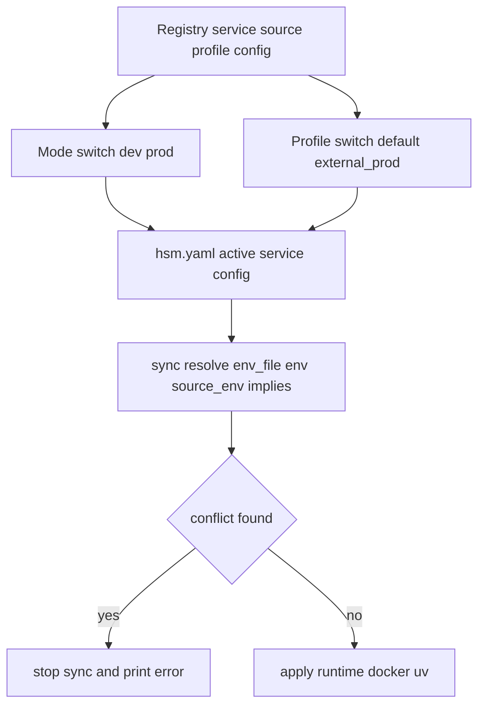

# План тест-дизайна для активных задач HSM

## Контекст

План покрывает задачи:
- [`add_env_file_support_for_hsm_services.md`](tasks_descriptions/tasks/add_env_file_support_for_hsm_services.md)
- [`add_git_init_to_component_init.md`](tasks_descriptions/tasks/add_git_init_to_component_init.md)

Тестовая методология и расположение тестов:
- [`tests/TESTS_OVERVIEW.md`](tests/TESTS_OVERVIEW.md)
- директория [`tests/`](tests/)

## Зафиксированные правила из обсуждения

1. Надежность через fail-fast: любая ошибка останавливает процесс и пишет ошибку в терминал.
2. Для `git-init` любая ошибка Git приводит к неуспешному завершению команды.
3. Для `env_file` во время `sync` любой дубликат ключа считается конфликтом и приводит к ошибке.
4. Поддерживаем один активный `env_file` на сервис в текущем активном режиме.
5. Переключение `mode` и `profile` должно корректно менять активный путь `env_file` в `hsm.yaml`.
6. Переключение `profile` обязательно тестируется и для standalone service, и для service_group.

## Архитектура тестового потока

## Стратегия по уровням

### Level 1: Logic CLI
- Проверка CLI-опций, валидации, записи в `hsm.yaml` и registry yaml.
- Быстрые проверки без тяжелой инфраструктуры.

### Level 2: System Subprocess
- Минимальная проверка, что новые CLI сценарии доступны через системный вызов `hsm`.

### Level 3: Environment High-Fidelity
- Реальные `uv`, `git`, `docker compose config`.
- Проверка реальных эффектов: `.git`, `.env` чтение, `docker-compose.hsm.yml`, `uv.lock`.

## Детальный тест-план: env_file

### A. CLI и контракты конфигурации

1. `ENV-CLI-001`: регистрация сервиса с `env_file` в реестре.
   - Ожидание: путь попадает в registry manifest сервиса.
   - Куда: расширение [`tests/test_cli_registry.py`](tests/test_cli_registry.py).

2. `ENV-CLI-002`: переключение `service mode dev/prod` обновляет активный `env_file` в `hsm.yaml`.
   - Ожидание: после `mode dev` выбран dev env_file, после `mode prod` выбран prod env_file.
   - Куда: расширение [`tests/test_cli_project.py`](tests/test_cli_project.py).

3. `ENV-CLI-003`: переключение `profile` обновляет активный `env_file` в `hsm.yaml`.
   - Ожидание: profile-specific env_file становится активным.
   - Куда: расширение [`tests/test_cli_project.py`](tests/test_cli_project.py).

4. `ENV-CLI-004`: то же для `service_group`.
   - Ожидание: profile группы влияет на выбранный сервис и его env_file.
   - Куда: расширение [`tests/test_cli_project.py`](tests/test_cli_project.py) и сценарий с группами в [`tests/test_environment_level.py`](tests/test_environment_level.py).

### B. High-Fidelity синхронизация

5. `ENV-HF-001`: docker runtime использует `env_file` в `docker-compose.hsm.yml`.
   - Ожидание: у сервиса есть `env_file`, файл валиден для `docker compose config`.
   - Куда: расширение [`tests/test_docker_validation.py`](tests/test_docker_validation.py).

6. `ENV-HF-002`: uv runtime получает переменные из `env_file`.
   - Ожидание: canary пакет успешно устанавливается, если ключ в env_file.
   - Куда: расширение [`tests/test_ves_env.py`](tests/test_ves_env.py).

7. `ENV-HF-003`: profile switch влияет на runtime ветку и env_file.
   - Ожидание: managed docker profile генерит compose; external profile исключает сервис из compose.
   - Куда: расширение [`tests/test_environment_level.py`](tests/test_environment_level.py).

8. `ENV-HF-004`: service_group profile switch ведет себя аналогично standalone.
   - Ожидание: поведение profile для группы детерминированно и отражается в sync.
   - Куда: расширение [`tests/test_environment_level.py`](tests/test_environment_level.py).

### C. Fail-fast и конфликтность

9. `ENV-FAIL-001`: отсутствующий env_file.
   - Ожидание: `sync` падает, сообщение содержит путь файла.

10. `ENV-FAIL-002`: невалидный формат строки в env_file.
    - Ожидание: `sync` падает, сообщение содержит строку и причину.

11. `ENV-FAIL-003`: дубликат ключа между env_file и `manifest.env`.
    - Ожидание: `sync` падает, сообщение содержит ключ и оба источника.

12. `ENV-FAIL-004`: дубликат ключа между env_file и `source.env`.
    - Ожидание: fail-fast с диагностикой.

13. `ENV-FAIL-005`: дубликат ключа между env_file и `implies params`.
    - Ожидание: fail-fast с диагностикой.

14. `ENV-FAIL-006`: дубликат ключа между `manifest.env`, `source.env`, `implies`.
    - Ожидание: fail-fast по любому дубликату во время sync.

Куда для fail-сценариев:
- добавить отдельный файл [`tests/test_env_file_failfast.py`](tests/test_env_file_failfast.py) для фокусной диагностики.

## Детальный тест-план: git-init

1. `GIT-CLI-001`: `hsm library init --help` и `hsm service init --help` показывают `--git-init`.
   - Куда: расширение [`tests/test_cli_project.py`](tests/test_cli_project.py).

2. `GIT-HF-001`: `hsm library init <name> --git-init` создает `.git`.
3. `GIT-HF-002`: `hsm service init <name> --git-init` создает `.git`.
4. `GIT-HF-003`: без `--git-init` директория `.git` не создается.

Куда:
- новый файл [`tests/test_project_init_git.py`](tests/test_project_init_git.py) или блок в [`tests/test_cli_project.py`](tests/test_cli_project.py).

5. `GIT-FAIL-001`: недоступный git binary.
   - Ожидание: команда падает с ненулевым кодом и печатает ошибку.

6. `GIT-FAIL-002`: ошибка `git init` в целевом каталоге.
   - Ожидание: команда падает, причина попадает в вывод.

Куда:
- фокусно в [`tests/test_project_init_git.py`](tests/test_project_init_git.py).

## Критерии приемки тест-дизайна

1. Все сценарии имеют однозначные ожидания pass/fail.
2. Все fail-fast сценарии проверяют не только код выхода, но и диагностическое сообщение.
3. Покрыты standalone и service_group ветки для profile switching.
4. Покрыты docker и uv runtime ветки для env_file.
5. Фокус приемки на alpha-сценариях `env_file` и `git-init` без требования backward compatibility.

## Порядок реализации тестов в Code режиме

### Принятый подход: Hybrid TDD (зафиксировано)

1. **Red (контракты + fail-fast):**
   - Сначала пишем и запускаем падающие тесты для `ENV-FAIL-*`, `GIT-FAIL-*` и CLI-контрактов.
   - Цель: зафиксировать ожидаемое поведение до изменения реализации.

2. **Implementation (минимум к green):**
   - Реализуем только необходимый функционал для прохождения Red-набора.
   - Сохраняем fail-fast семантику и диагностику ошибок.

3. **Green / High-Fidelity:**
   - Добавляем и доводим до green сценарии уровня окружения (`docker`, `uv`, `git`).
   - Подтверждаем корректность mode/profile переключений для standalone и service_group.

4. **Consolidation:**
   - Обновляем обзор тестов в [`tests/TESTS_OVERVIEW.md`](tests/TESTS_OVERVIEW.md).
   - Фиксируем статус в Memory Bank для передачи контекста в следующую сессию.

## Состояние текущей сессии

- Подход **Hybrid TDD** согласован с пользователем.
- Черновой Red-набор начат через [`tests/test_env_file_failfast.py`](tests/test_env_file_failfast.py).
- Для новой сессии этот документ является source of truth по тестовой стратегии.
