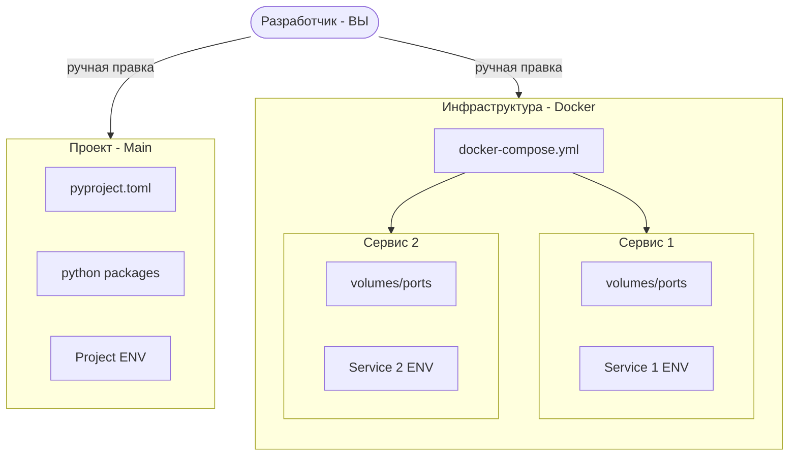
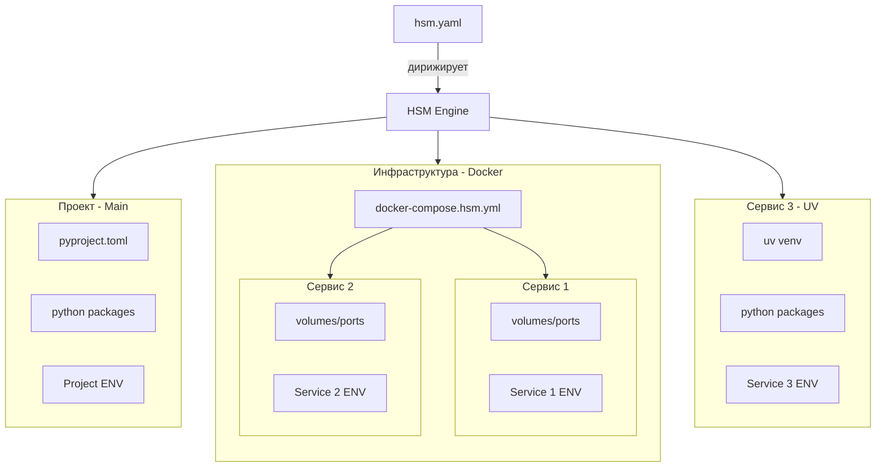
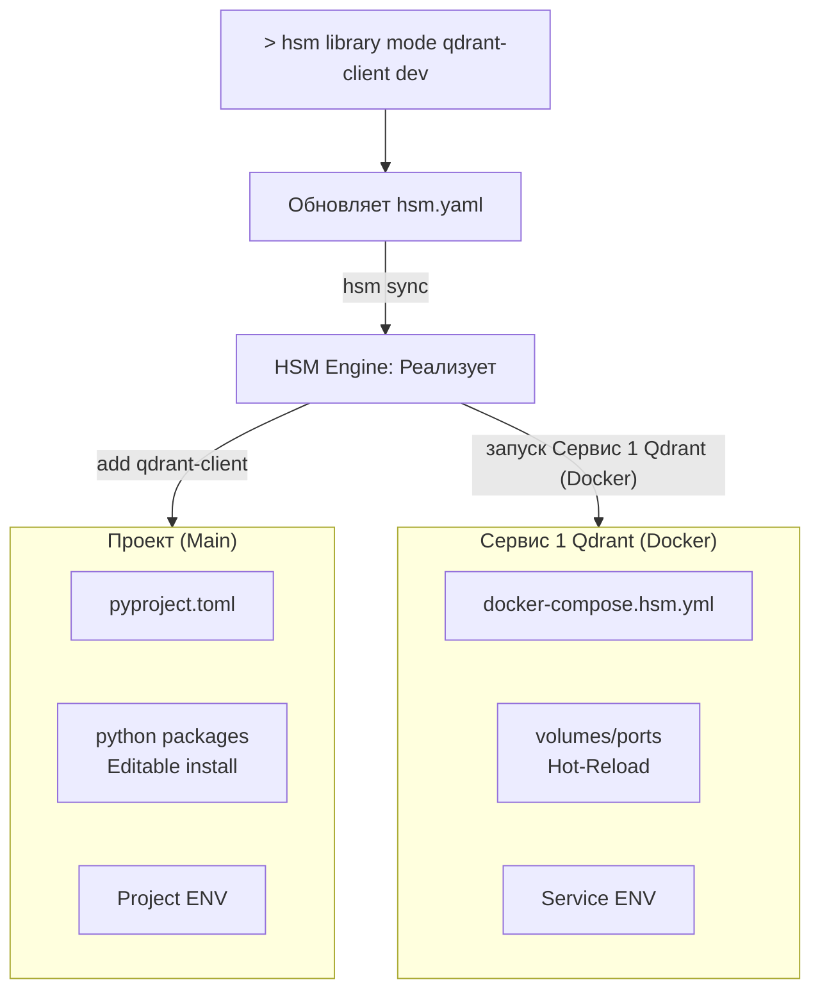
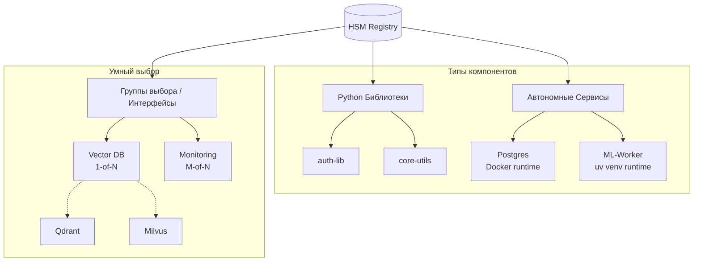

# HYPER STACK MANAGER
**Гипервизор окружений для современных гибридных стеков**

[БЫСТРЫЙ СТАРТ - 5 МИН](/docs/intro)

---

## Основные возможности

### Lego-архитектура
Собирайте свой стек из независимых компонентов. Легко подменяйте реализации интерфейсов (например, одну векторную БД на другую) одной командой.

### Гибридная оркестрация
Единое управление Python-пакетами (через uv) и инфраструктурными сервисами (через docker compose) в одном манифесте.

### Атомарная синхронизация
Транзакционное обновление конфигураций. Если зависимости не разрешаются, ваши рабочие файлы остаются в стабильном состоянии.

---

## О проекте HYPER STACK MANAGER (HSM)

> Объедините Python-пакеты и сервисы (Docker и uv venv) в единую, управляемую экосистему.

В HSM всё строится вокруг понятия **Компонента**.

> **Компонент** — это отдельный Git-репозиторий, который может быть Python-пакетом или сервисом (Docker и uv venv).

Реестр хранит данные о компонентах, позволяя собирать проект из них как конструктор.

---

## Зачем это нужно?

Разработка современных многокомпонентных систем — это хаос из разрозненных инструментов.
Вы правите код в одном месте, конфиги сервисов в другом, а переменные окружения — в третьем.

### Раньше: Ручная синхронизация стека разработки



**Почему это неудобно?**

*   **Ручная синхронизация (Manual Glue)**: Вы — единственный "оркестратор". Вы вручную синхронизируете pyproject.toml, docker-compose.yml и .env. Ошибка в одной строке — и проект не запускается.
*   **Статичная инфраструктура**: docker-compose.yml не знает о ваших намерениях. Переключение между prod и dev — это рутина с комментариями и правкой путей.
*   **Проблемы модульной разработки**: Работа с вложенными Git-репозиториями вызывает трудности. uv workspaces требует жесткой структуры, а git submodules — ручного управления.
*   **Слепые зависимости**: Вы добавляете библиотеку, но надеетесь, что не забыли поднять для неё базу. Зависимости живут только в вашей голове.
*   **Конфликты в Python-окружении**: Попытка запустить два сервиса с разными версиями одной библиотеки в одном монорепозитории превращается в квест.
*   **Неатомарные правки**: Ошибка установки оставляет проект в "полусломанном" состоянии. Откатывать изменения приходится вручную.

### С HSM: Декларативное единство



#### Динамический "Виртуальный Монорепозиторий"
HSM позволяет работать с распределенной системой как с единым целым:
*   **Чистота Polyrepo**: Каждый компонент сохраняет свою историю и независимость.
*   **Удобство Monorepo**: В режиме `dev` HSM материализует нужные компоненты в единое рабочее пространство.
*   **Инфраструктура, следующая за кодом**: Ваше окружение — это не только файлы, но и живые сервисы с автоматической оркестрацией, Hot-Reload и пробросом ENV-контекста.

#### Покомпонентный контроль (Granular Control)
Вы управляете состоянием каждого компонента отдельно:
*   **Режим `prod`**: Использование стабильных версий (пакеты из Git/PyPI или готовые Docker-образы).
*   **Режим `dev`**: Переключение компонента на **локальные исходники** (editable install или `build` контекст).
*   **Смешанный стек**: Можно держать весь проект в `prod`, но одну библиотеку, в которой правите баг, переключить в `dev`.

---

## Умные зависимости (Implies)

Выбранные Python-пакеты умеют "заказывать" инфраструктуру. Если вы добавляете библиотеку `auth-plugin`, HSM сам поймет, что ей нужен сервис `postgres`, добавит его в стек и настроит доступы.
И наоборот, выбранный сервис может заказать Python-пакет.

> Вы описываете Намерение через CLI-команды (что вы хотите), HSM берет на себя Реализацию (как это настроить).



---

## Атомарная синхронизация

Синхронизация — это транзакция. Если зависимости не сошлись, HSM откатит изменения в конфигах.

### Синхронизация в деле

```bash
$ hsm service mode auth-service dev
# 1. Переключаем сервис в режим разработки

$ hsm sync
# 2. Синхронизируем стек

› Finding auth-service in Registry... [OK]
› Generating docker-compose.hsm.yml... [OK]
› Injecting ENV variables... [OK]
› Restarting container with local volumes... [OK]
```

> **SUCCESS**: Стек синхронизирован. Вы правите код — изменения мгновенно подхватываются в контейнере.

---

## Анатомия проекта

*   **hsm.yaml**: Манифест вашего проекта. Single Source of Truth, который можно править вручную или через CLI.
*   **Реестр (Registry)**: База знаний о компонентах. Описывает, откуда брать код и как запускать сервисы.
*   **Адаптеры**: Модули-исполнители, которые транслируют ваши желания в команды для uv, docker, pixi и др.

---

## Реестр: База знаний вашего стека

Реестр — это не просто список зависимостей, это **интеллект вашего проекта**. Настройте его один раз и переиспользуйте между командами и проектами.



*   **Python-пакеты**: Описание источников (Git/PyPI/Local) и зависимостей. Полная поддержка editable-режима.
*   **Docker-сервисы**: Готовые образы или локальные репозитории для сборки с автоматическим пробросом томов.
*   **uv venv (VES)**: Полностью изолированные Python-сервисы со своими lock-файлами через Virtual Environment Services.
*   **Группы (Интерфейсы)**: Абстрагируйтесь от реализаций. Выбирайте "Векторную БД", а не конкретный конфиг.

---

## Коротко о главном

| HSM — это | HSM — это НЕ |
| :--- | :--- |
| **Мета-оркестратор**: Дирижер для uv, docker и git. | **НЕ замена uv или docker**: Он использует их мощь. |
| **Гипервизор окружений**: Абстракция над стеком. | **НЕ система сборки**: Он не заменяет make или hatch. |
| **Инструмент для DX**: Убирает рутину. | **НЕ замена Git**: Он автоматизирует работу с ним. |

---

## Быстрый старт

**# 1. Установка**
```bash
uv tool install git+https://github.com/VLMHyperBenchTeam/hsm.git
```

**# 2. Инициализация**
```bash
hsm init
```

**# 3. Добавление компонента**
```bash
hsm library add my-cool-lib
```

**# 4. Синхронизация**
```bash
hsm sync
```

[Пройти вводный туториал (120 секунд)](/docs/intro)

---

## Готовы объединить Python и сервисы?

Не тратьте свое время на ручную синхронизацию конфигов. Позвольте HSM сделать это для вас.
