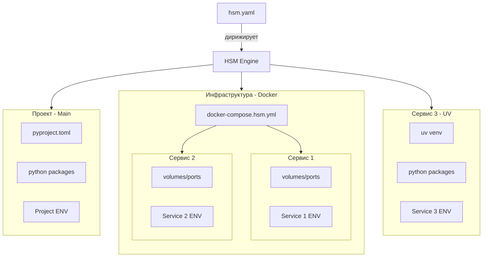
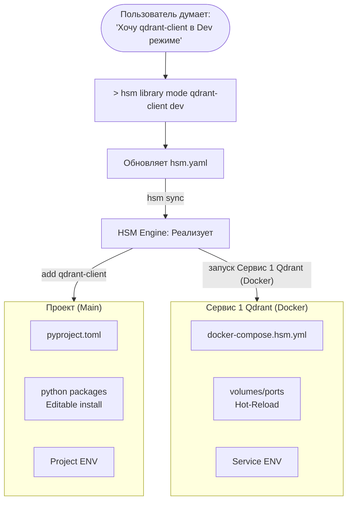
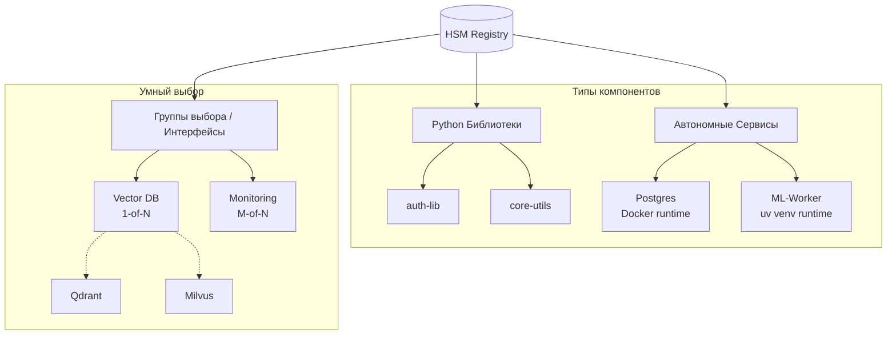

# Финальный черновик главной страницы HSM

> [!NOTE] Source: feedback_2026-02-14_05-52-30.md
> **User Insight**: Необходим "Elevator Pitch" на 2 минуты, который четко объяснит ценность проекта, иначе пользователи уйдут, не поняв "дичь" это или полезный инструмент.

## 🎯 Elevator Pitch (2 минуты на понимание)
**HSM (Hyper Stack Manager)** — это "умный клей" для ваших Python-проектов и Docker-инфраструктуры.

Если вы устали вручную синхронизировать `pyproject.toml`, `docker-compose.yml` и `.env` при переключении между "правлю код" и "использую готовый образ" — HSM сделает это за вас одной командой.

**Три кита HSM:**
1. **Единый манифест**: Описываете *намерение* (хочу этот сервис в dev-режиме), а не правите конфиги.
2. **Мгновенное переключение**: Одной командой переводите любую библиотеку или сервис из `prod` (образ/пакет) в `dev` (локальные исходники).
3. **Умные связи**: Добавили библиотеку — HSM сам поднял нужную ей базу данных.

## О проекте
**HYPER STACK MANAGER**
> Объедините Python-пакеты и сервисы (Docker и uv venv) в единую, управляемую экосистему.

В HSM всё строится вокруг понятия **Компонента**.
> **Компонент** — это отдельный Git-репозиторий, который может быть Python-пакетом или сервисом (Docker и uv venv). 

Реестр хранит данные о компонентах, позволяя собирать проект из них как конструктор.

---

## Зачем это нужно?

Разработка современных многокомпонентных систем — это хаос из разрозненных инструментов.

- правите код в одном месте
- конфиги сервисов в другом
- а переменные окружения — в третьем.

### Раньше: Ручная синхронизация стека разработки


**Почему это неудобно?**
*   **Ручная синхронизация (Manual Glue)**: Вы — единственный "оркестратор". Вы вручную синхронизируете `pyproject.toml`, `docker-compose.yml` и `.env`. Ошибка в одной строке — и проект не запускается.
*   **Статичная инфраструктура**: `docker-compose.yml` не знает о ваших намерениях.
Переключение между "использовать готовый образ" (prod) и "править код внутри контейнера"(dev) — это  рутина с комментариями и правкой путей. Особенно когда для исправления бага все сервисы должны быть запущены в prod, а два в dev.
*   **Проблемы модульной разработки**: Работа с кодом с использованием вложенных Git-репозиториев вызывает трудности. `uv workspaces` требует жесткой привязки к конкретным ко на диске, а `git submodules` — ручного управления коммитами.
*   **Слепые зависимости**: Вы добавляете библиотеку, но *надеетесь*, что не забыли поднять для неё базу. Зависимости между кодом и инфраструктурой живут только в вашей голове, а не в конфиге.
*   **Конфликты в Python-окружении**: Попытка запустить два сервиса с разными версиями одной библиотеки (например, Pydantic v1 и v2) в одном монорепозитории превращается в неразрешимый квест. HSM решает это через VES (Virtual Environment Services), обеспечивая полную изоляцию для каждого сервиса.
*   **Неатомарные правки**: Вы изменили `pyproject.toml` или `docker-compose.yml`, запустили установку, она упала — и теперь ваш проект в "полусломанном" состоянии. Откатывать изменения в коде и инфраструктуре приходится вручную.

### С HSM: Декларативное единство



### 🧩 Динамический "Виртуальный Монорепозиторий"
HSM позволяет работать с распределенной системой как с единым целым:
*   **Чистота Polyrepo**: Каждый компонент сохраняет свою историю и независимость.
*   **Удобство Monorepo**: В режиме `dev` HSM материализует нужные компоненты в единое рабочее пространство.
*   **Инфраструктура, следующая за кодом**: Ваше окружение — это не только файлы, но и живые сервисы с автоматической оркестрацией, Hot-Reload и пробросом ENV-контекста.

### ⚡️ Покомпонентный контроль (Granular Control)
Вы управляете состоянием каждого компонента отдельно:
*   **Режим `prod`**: Использование стабильных версий (пакеты из Git/PyPI или готовые Docker-образы).
*   **Режим `dev`**: Переключение компонента на **локальные исходники** (editable install или `build` контекст).
*   **Смешанный стек**: Можно держать весь проект в `prod`, но одну библиотеку, в которой правите баг, переключить в `dev`.

### 🧠 Умные зависимости (Implies)
Компоненты умеют "заказывать" инфраструктуру. Если вы добавляете библиотеку `auth-plugin`, HSM сам поймет, что ей нужен сервис `postgres`, добавит его в стек и настроит доступы.

> [!IMPORTANT]
> **HSM — это НЕ LLM-агент.**
> Под капотом нет нейросетей, управляющих вашим кодом. Это детерминированный алгоритмический инструмент. Вы описываете **Намерение** через CLI-команды, а HSM выполняет четко заданные сценарии автоматизации.



### 🛡️ Атомарная синхронизация
Синхронизация — это транзакция. Если зависимости не сошлись, HSM откатит изменения в конфигах. Проект никогда не останется в "полусломанном" состоянии.

---

## 🚀 Посмотрите в деле (Visual Proof)

Представьте, вам нужно поправить баг в сервисе `auth-service`, который сейчас работает как готовый Docker-образ.

```bash
# 1. Переключаем сервис в режим разработки
hsm service mode auth-service dev

# 2. Синхронизируем стек
hsm sync
```

**Что сделает HSM:**
1.  Найдет исходники `auth-service` в Реестре.
2.  Сгенерирует `docker-compose.hsm.yml` с `build` контекстом и `volumes`.
3.  Прокинет нужные ENV-переменные.
4.  Перезапустит только этот сервис с монтированием вашего локального кода.
**Результат**: Вы правите код — изменения мгновенно подхватываются в контейнере.

---

## 📦 Анатомия проекта

*   **`hsm.yaml`**: Манифест вашего проекта. Single Source of Truth, который можно править вручную или через CLI.
*   **Реестр (Registry)**: База знаний о компонентах. Описывает, откуда брать код и как запускать сервисы.
*   **Адаптеры**: Модули-исполнители, которые транслируют ваши желания в команды для `uv`, `docker`, `pixi` и др.

---

## � Реестр: База знаний вашего стека

Реестр — это не просто список зависимостей, это **интеллект вашего проекта**. Настройте его один раз и переиспользуйте между командами и проектами.



*   **Python-пакеты**: Описание источников (Git/PyPI/Local) и зависимостей.
*   **Docker-сервисы**: Готовые образы или локальные репозитории для сборки с пробросом томов.
*   **uv venv (VES)**: Полностью изолированные Python-сервисы со своими lock-файлами.
*   **Группы (Интерфейсы)**: Абстрагируйтесь от реализаций. Выбирайте "Векторную БД", а не конкретный конфиг.

---

## 🛠 Современный CLI
*   **Удобен для разработчиков**: Интерактивный режим, умное автодополнение и пошаговые опросы (Wizard).
*   **LLM & CI Ready**: Все команды поддерживают неинтерактивный режим. Идеально для автоматизации и AI-агентов.

---

## ❓ Почему не стандартные средства?

### HSM vs Git Submodules
*   **Гибкость**: HSM привязывается к версиям/тегам, а не к жестким коммитам.
*   **On-Demand**: Вы скачиваете только те модули, которые правите сейчас.
*   **Чистота**: Основной репозиторий не знает о внутренностях других проектов.

### HSM vs UV Workspaces
*   **Динамика**: Собирает проект из разных репозиториев на лету, а не требует их наличия на диске.
*   **Умный поиск**: HSM сам находит пути к компонентам через Реестр.
*   **Инфраструктура**: UV не знает про Docker, а HSM — знает.

---

## 🎯 Коротко о главном

| ✅ HSM — это | ❌ HSM — это НЕ |
| :--- | :--- |
| **Мета-оркестратор**: Дирижер для uv, docker и git. | **НЕ замена uv или docker**: Он использует их мощь. |
| **Гипервизор окружений**: Абстракция над стеком. | **НЕ система сборки**: Он не заменяет make или hatch. |
| **Инструмент для DX**: Убирает рутину. | **НЕ замена Git**: Он автоматизирует работу с ним. |

---

## 🏁 Быстрый старт

```bash
# 1. Установка
uv tool install git+https://github.com/VLMHyperBenchTeam/hsm.git

# 2. Инициализация
hsm init

# 3. Добавление компонента
hsm library add my-cool-lib

# 4. Синхронизация
hsm sync
```

---

## 👥 Для кого HSM?
*   **Разработчики микросервисов**: Кому надоело вручную синхронизировать десятки репозиториев.
*   **Платформенные инженеры**: Кто хочет дать командам стандартизированный способ сборки окружения.
*   **ML-инженеры**: Кому нужно быстро переключаться между разными версиями библиотек и контейнеров.

---

## 🏁 Готовы объединить Python и сервисы?

Не тратьте свое время на ручную синхронизацию конфигов. Позвольте HSM сделать это для вас.

[Пройти вводный туториал (120 секунд)]