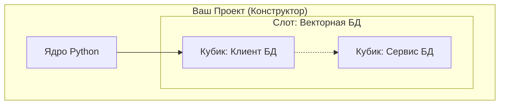

# Финальный черновик главной страницы HSM (Версия 3: Конструктор)

> [!NOTE] Source: feedback_2026-02-14_06-01-01.md
> **User Insight**: Упростить язык, использовать аналогию с конструктором, четко разделить Намерение (CLI) и Реализацию (Sync). Показать пример с заменой БД. Убрать эмодзи.

## О проекте
**HSM (Hyper Stack Manager)** — это инструмент, который превращает ваш проект в конструктор, состоящий из независимых компонентов.

В обычном проекте код и инфраструктура "склеены" намертво. Чтобы заменить базу данных или библиотеку, нужно переписывать конфиги в трех местах.
В HSM вы собираете рабочее окружение как конструктор: просто заменяете один кубик на другой, а система сама перестраивает все связи.

---

## Что такое Компонент?
**Компонент** — это любой "кирпичик" вашего проекта.

Это может быть:
*   **Python-пакет** (библиотека).
*   **Сервис** (база данных, брокер очередей, API, ML-модель развернутая в виде сервиса на инференсе).

Каждый сервис изолирован:
- либо на уровне python venv (виртуального окружения `uv` / `pixi`)
- либо контейнеризацией (`docker` / `podman`)

Для HSM это одно и то же — "черный ящик", который выполняет функцию.

### Визуализация: Проект как Конструктор

Представьте ваш проект как набор слотов, куда вставляются кубики-компоненты.

1.  **Проект**: Состоит из кубиков-пакетов (Python).
2.  **Инфраструктура**: Состоит из кубиков-сервисов (Docker или Venv).

HSM — это "клей", который соединяет их вместе.



Это живая система. Вы меняете один кубик (например, Клиент БД), и HSM автоматически обновляет связанный с ним кубик (Сервис БД) и настраивает переменные окружения.

---

## Проблема: "Склеенный монолит"
Вы разрабатываете сложную систему. У вас есть код (Python) и инфраструктура (Docker).
Обычно они связаны вручную:
1.  В коде прописаны хосты и порты.
2.  В `docker-compose.yml` прописаны версии образов.
3.  В `pyproject.toml` прописаны версии библиотек.

**Хотите заменить векторную базу Milvus на Qdrant?**
Вам придется вручную править все три файла. Ошиблись в одной букве — ничего не работает.

---

## Решение: Намерение и Реализация

HSM разделяет "Что я хочу" и "Как это сделать".

### 1. Намерение (Intent)
Вы не правите конфиги руками. Вы сообщаете системе свое желание через простую команду.
Это ваш **Заказ**.

```bash
# "Хочу использовать Qdrant вместо Milvus"
hsm select vector-db qdrant
```

HSM записывает это в **Манифест** (`hsm.yaml`) — главный чертеж вашего проекта.

### 2. Реализация (Implementation)
Вы запускаете **Построитель**.

```bash
# "Построй мне это!"
hsm sync
```

HSM читает чертеж и запускает прокт из собранных вами компонентов:
*   Удаляет старый пакет `milvus-client` и ставит `qdrant-client`в `venv` проекта.
*   Останавливает контейнер `Milvus` и запускает `Qdrant`.
*   Пробрасывает новые переменные окружения (HOST, PORT, API_KEY) в ваш код для совметной работы `qdrant-client` и `Qdrant`.

---

## Быстрый старт

```bash
# 1. Установка
uv tool install git+https://github.com/VLMHyperBenchTeam/hsm.git

# 2. Инициализация
hsm init

# 3. Добавление компонента (HSM сам найдет его в Реестре)
hsm library add my-app-core

# 4. Сборка конструктора
hsm sync
```

[Посмотреть полный туториал]
