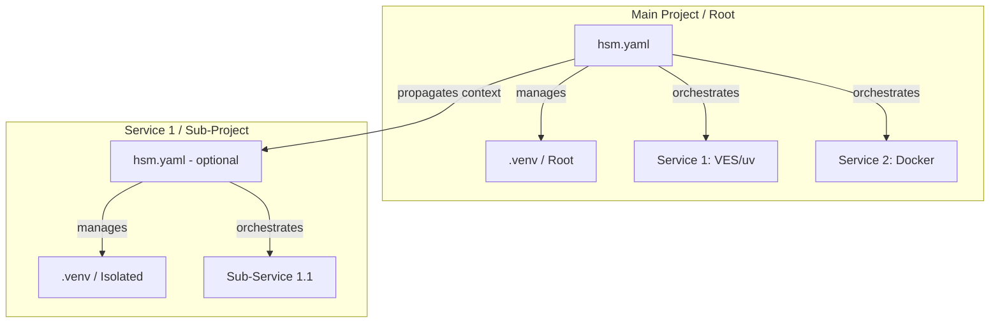

# Plan: Recursive Projects (The Matryoshka Concept)

## 1. Видение
HSM эволюционирует в рекурсивный оркестратор, где каждый компонент (сервис) может сам являться HSM-проектом. Это позволяет строить сложные иерархические системы с сохранением полной изоляции и декларативного управления на каждом уровне.

## 2. Архитектурная схема

## 3. Ключевые принципы

### 3.1. Иерархия намерений (Intent Hierarchy)
*   **Main Project**: Определяет глобальный стек и зависимости между крупными блоками.
*   **Sub-Project (Service)**: Определяет свои внутренние зависимости. Если в подпроекте есть `hsm.yaml`, HSM может рекурсивно управлять им.

### 3.2. Проброс контекста (Context Propagation)
Родительский проект может передавать дочернему:
*   **Environment Variables**: Через механизм `env` и `implies`.
*   **Registry Access**: Дочерний проект может использовать тот же реестр, что и родитель.

### 3.3. Управление зависимостями (The "uv add" Pattern)
Для сохранения чистоты и ответственности инструментов:
1.  HSM вычисляет необходимые пакеты для сервиса (из его манифеста + `implies` родителя).
2.  HSM вызывает `uv add --no-workspace <packages>` внутри папки сервиса.
3.  `uv` берет на себя обновление `pyproject.toml` и `uv.lock`.
4.  HSM вызывает `uv sync` для материализации.

## 4. Сценарии использования

### 4.1. Разработка плагинов
Основное приложение требует плагин. Плагин — это изолированный сервис. HSM клонирует репо плагина, пробрасывает ему API-ключи основного приложения и устанавливает необходимые SDK.

### 4.2. Микросервисная отладка
Разработчик запускает `hsm sync` в корне. HSM поднимает БД в докере и 3 микросервиса в изолированных venv, настраивая их на работу с этой БД через ENV.

## 5. Этапы реализации (в рамках текущей задачи)
1.  **Data Layer**: Добавление `dependencies` в `ServiceManifest`.
2.  **Adapter Layer**: Реализация «чистого» управления через `uv add`.
3.  **Sync Layer**: Сбор и проброс зависимостей/ENV вниз по иерархии.