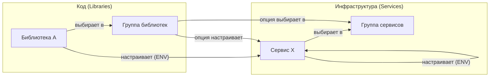

# Механизм Implies (Зависимости)

## Обзор

Механизм **Implies** (Подразумевает) — это "умная" система связей в HSM, которая позволяет описывать декларативные зависимости между компонентами. Это ключевой инструмент для реализации **Meta-Orchestration**, позволяющий одной части системы (например, коду) автоматически настраивать другую (например, инфраструктуру).

В отличие от жестких зависимостей (`dependencies`), которые просто гарантируют наличие компонента, `implies` передает контекст и управляет выбором.

## Матрица отношений (Implies)

HSM поддерживает гибкую систему связей между всеми типами компонентов реестра:

| Кто влияет (Source) | На кого влияет (Target) | Что происходит | Пример использования |
| :--- | :--- | :--- | :--- |
| **Библиотека** | **Сервис** | Передача параметров (ENV) | `auth-lib` -> `service:postgres` {`db_name: auth`}. Библиотека сама "говорит" базе, как должна называться её БД. |
| **Библиотека** | **Группа** | Авто-выбор опции | `fastapi` -> `library_group:server` {`uvicorn`}. Фреймворк сам выбирает подходящий сервер из группы. |
| **Сервис** | **Сервис** | Передача параметров (ENV) | `web-app` -> `service:redis` {`db_index: 1`}. Один сервис настраивает другой под свои нужды. |
| **Сервис** | **Группа** | Авто-выбор опции | `ml-service` -> `library_group:cuda` {`v12`}. Сервис выбирает нужную версию драйверов в проекте. |
| **Опция группы** | **Сервис** | Передача параметров (ENV) | Выбор `postgres` в `db-group` -> `service:backup` {`type: sql`}. Выбор реализации БД настраивает сервис бэкапов. |
| **Опция группы** | **Группа** | Авто-выбор опции | Выбор `react` в `frontend-group` -> `library_group:ui` {`mui`}. Выбор фреймворка сужает выбор UI-кита. |

## Визуализация связей



## Ключевые концепции

### 1. Cross-Domain (Код -> Инфраструктура)
Это уникальная особенность HSM. Код (библиотека) может влиять на инфраструктуру (сервис). Это позволяет создавать автономные компоненты, которые сами "заказывают" и настраивают необходимые им ресурсы.

### 2. Implication Merging (Слияние параметров)
Если несколько компонентов влияют на один и тот же сервис, HSM не создает конфликтов, а **сливает** их параметры. 
Например, если `auth-lib` требует `db_name=auth`, а `billing-lib` требует `db_name=billing` для одного сервиса `postgres`, HSM объединит их. В манифесте сервиса это можно использовать так:
```yaml
env:
  POSTGRES_DATABASES: "${HSM_MERGED_PARAMS.db_name}" # Результат: auth,billing
```

### 3. Late Binding (Позднее связывание)
Связи вычисляются в момент `hsm sync`. Это означает, что при замене одного компонента (например, переходе с `FastAPI` на `Django`), весь остальной стек (серверы, базы, конфиги) перестроится автоматически согласно новым импликациям.

## Использование в Реестре

Импликации описываются в манифестах компонентов в секции `implies`.

### Пример: Библиотека настраивает сервис
```yaml
# hsm-registry/libraries/my-auth-lib.yaml
name: my-auth-lib
implies:
  service:postgres:
    params:
      db_name: auth_db
      db_user: auth_admin
```

### Пример: Опция группы выбирает другую группу
```yaml
# hsm-registry/library_groups/web-frameworks.yaml
name: web-frameworks
options:
  - name: fastapi
    implies:
      library_group:server: uvicorn
```

## Управление через CLI

Для управления импликациями используются команды `registry ... implies`:

```bash
# Добавить настройку сервиса для библиотеки
hsm registry library implies add auth-lib service:postgres db_name=auth_db

# Добавить авто-выбор в группе
hsm registry library implies add fastapi library_group:server uvicorn
```

## Преимущества
*   **Декларативность**: Все связи описаны явно, а не скрыты в коде или скриптах.
*   **Целостность**: Гарантирует, что инфраструктура всегда соответствует потребностям кода.
*   **Масштабируемость**: Позволяет легко менять реализации компонентов, не ломая зависимости во всем проекте.